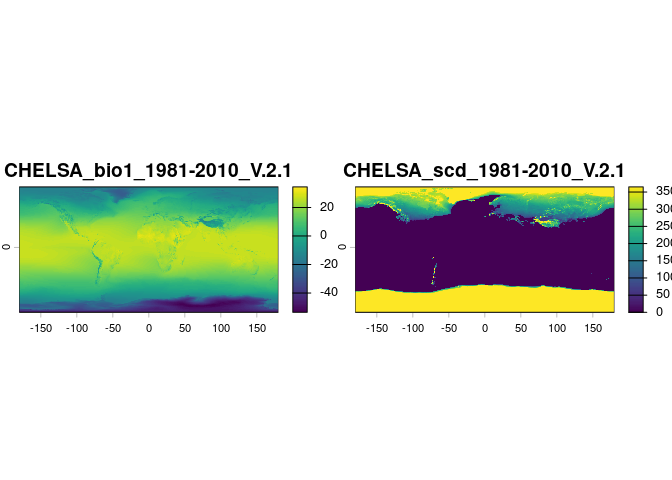
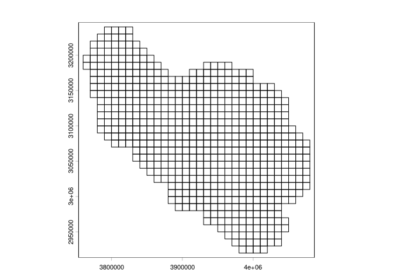
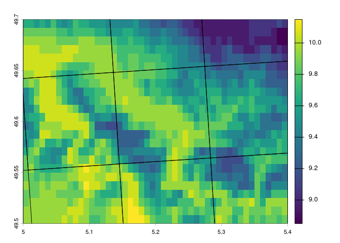
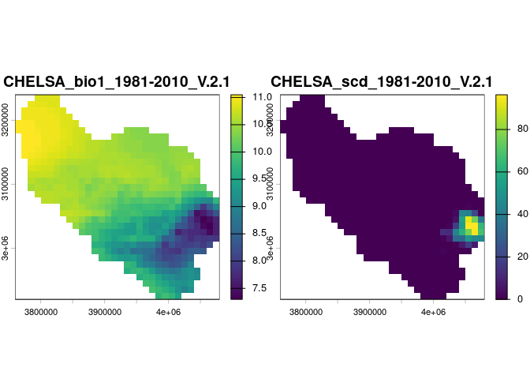
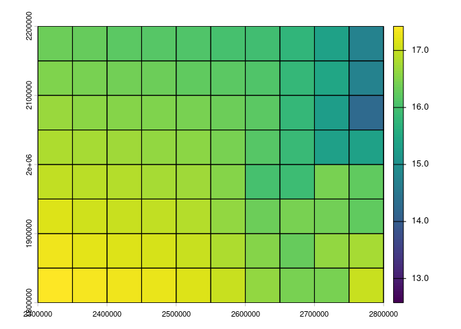

<!-- README.md is generated from README.Rmd. Please edit that file -->

# regridR: re-grid raster layers

Most global-coverage raster layers containing variables used in species
distribution models come in unprojected longitude-latitude coordinates,
with a nominal spatial resolution like “approximately 1x1 km2 at the
equator”. One problem is that lon-lat pixels are not equal-area, and
they’re not really 1x1-km2 either (or whatever is their nominal
resolution): Because the longitude meridians converge towards the poles,
lon-lat pixels cover progressively smaller areas as we move away from
the Equator, and they are already considerably smaller than their
nominal resolution across temperate areas like Europe. Their actual
sizes can be checked e.g. with the `terra::cellSize()` function.

If we want our raster variables on a grid of pixels that matches an
equal-area grid within a given region (such as the EEA reference grid in
Europe), we can use the `regrid()` function to convert raster layers
into such equal-area grid. Below is a worked example. We start by
downloading some variable layers from the CHELSA website, using the
`downloadif()` function also included in the `regridR` package. This
will download files if they haven’t already been completely downloaded
and saved in the destination folder:

``` r
# LOAD REQUIRED PACKAGES ----

library(regridR)

library(terra)
#> terra 1.9.13


# DOWNLOAD SOME VARIABLES ----

# get CHELSA climate links for a couple variables:
links <- linkbuild(c("bio1", "scd"))

# create a folder for receiving downloads:
dir.create("outputs/variables", recursive = TRUE)
#> Warning in dir.create("outputs/variables", recursive = TRUE):
#> 'outputs/variables' already exists

# allow longer download times:
options(timeout = 6000)

# download variables if not already there:
downloadif(links, destdir = "outputs/variables")
#> 1
#> CHELSA_bio1_1981-2010_V.2.1.tif
#> 2
#> CHELSA_scd_1981-2010_V.2.1.tif

# import variables from downloads folder:
layers <- terra::rast(list.files("outputs/variables", full.names = TRUE))

terra::plot(layers, nc = 1)
```



Next, we will import a vector polygon map of an equal-area grid
recommended by the European Environment Agency (EEA):

``` r
# IMPORT EQUAL-AREA VECTOR GRID ----

EEAgrid <- terra::vect(system.file("extdata/eea10_belgium.gpkg", 
                                   package = "regridR"))

terra::plot(EEAgrid)
```



We can project the vector grid to overlay a part of the climate layers,
and see that they don’t align (and the pixels are not equal-area), so
simply aggregating the raster pixels wouldn’t be a good option:

``` r
terra::plot(layers[[1]], maxcell = ncell(layers), ext = c(5, 5.4, 49.5, 49.7))

terra::plot(terra::project(EEAgrid, layers), add = TRUE)
```



So, we’ll use the `regrid()` function of the `regridR` package to get
the climate layers on a raster grid whose pixels match the input EEA
grid cells:

``` r
# RE-GRID LAYERS ----

layers_regrid <- regridR::regrid(layers = layers, grid = EEAgrid, 
                                 na.rm = TRUE, touches = TRUE)

terra::plot(layers_regrid)
```

By default, `regrid()` will use the `mean()` function to summarize the
values of the pixels falling within each polygon grid cell, and the
`terra::zonal()` function to do this summarizing. However, installing
also the `exactextractr` package and **running `regrid()` with the
argument `exactextract = TRUE`** can make the computation **considerably
faster** for large grids, albeit with a slightly different algorithm:

``` r
# RE-GRID LAYERS FASTER ----

layers_regrid <- regridR::regrid(layers = layers, grid = EEAgrid, 
                                 exactextract = TRUE)
#> projecting 'grid' to overlay 'layers'
#> extracting 'layers' to projected 'grid' (can take a while for dense grids...)
#> rasterizing input 'grid' with extracted 'layers' values
#> finished!

terra::plot(layers_regrid)
```



We can visually check that the output (re-gridded) `layers`’ pixels
align with the input EEA `grid`:

``` r
terra::plot(layers_regrid[[1]])

terra::plot(EEAgrid, lwd = 0.2, add = TRUE)
```


